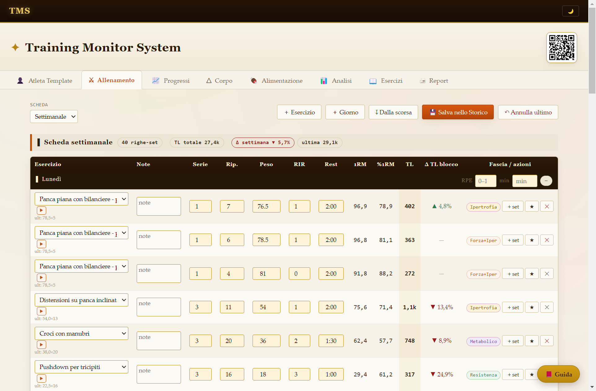
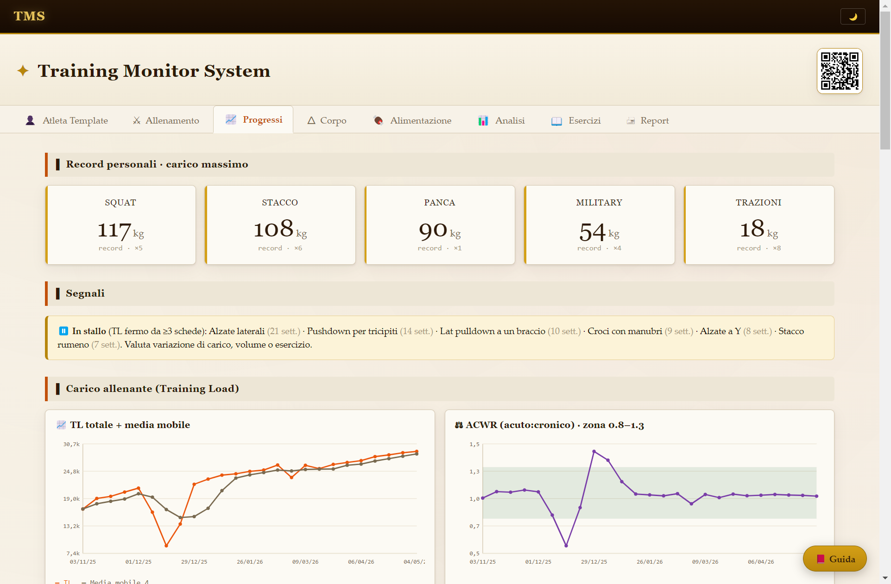
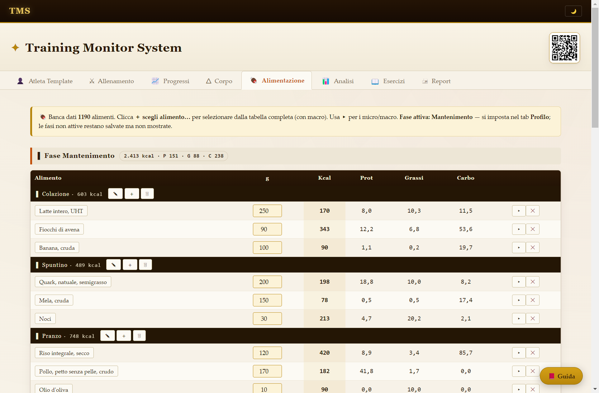
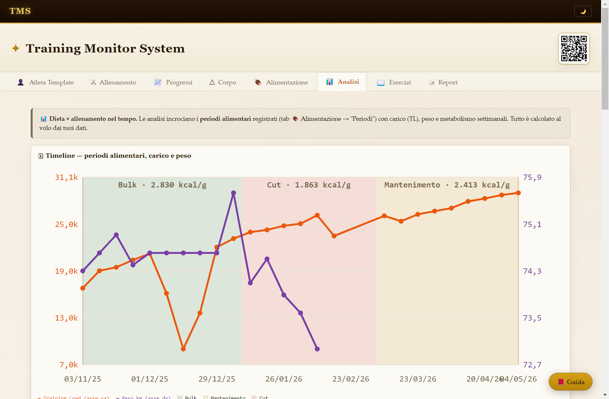

<p align="center"></p>

# Training Monitor System (TMS)

App desktop Windows per la gestione completa di **allenamento e nutrizione**: scheda
settimanale/mensile, storico con carichi e RPE, progressi (1RM stimato, Training Load,
ACWR, monotonia), misure corporee, piani alimentari su banca dati USAV (~900 alimenti),
catalogo di 883 esercizi con video dimostrativi, report PDF A4 e report digitale per
mobile. Tema pergamena/ember, modalità notte. *By Wander.*

🌐 **Sito**: [marcomartinellione-create.github.io/TMS](https://marcomartinellione-create.github.io/TMS/) ·
⭳ [Scarica l'ultima versione](https://github.com/marcomartinellione-create/TMS/releases/latest)

## Caratteristiche

- **Tutto in locale, zero cloud**: i dati restano sul tuo PC
  (`%APPDATA%\Training Monitor System\TMS`), nessun account, nessuna telemetria.
- **Multi-profilo**: più atleti/clienti, ciascuno con scheda, storico, misure e
  alimentazione propri; catalogo esercizi condiviso.
- **Valori derivati mai salvati**: 1RM, Training Load, ACWR ricalcolati al volo dai
  dati grezzi — niente numeri incoerenti.
- **Auto-update**: l'app controlla le release GitHub all'avvio e si aggiorna da sola.
- **Backup**: esporta/importa tutti i dati in un singolo file JSON.

## Screenshot

Il profilo dimostrativo **Atleta Template** (incluso nell'installer) in azione:

| | |
|---|---|
| [](docs/img/allenamento.png) ⚔ **Allenamento** — scheda settimanale, 1RM/%1RM/TL al volo | [](docs/img/progressi.png) 📈 **Progressi** — record, segnali, TL e ACWR |
| [](docs/img/alimentazione.png) 🍖 **Alimentazione** — piani per fase su banca USAV, indice OMS | [](docs/img/analisi.png) 📊 **Analisi** — dieta × allenamento nel tempo |

## Installazione

🎓 **Video tutorial**: [youtube.com/@TrainingMonitorSystem](https://www.youtube.com/@TrainingMonitorSystem)

1. Scarica `TMS-Setup-<versione>.exe` dall'ultima [Release](https://github.com/marcomartinellione-create/TMS/releases).
2. Eseguilo (installer assistito, percorso modificabile). SmartScreen può avvisare al
   primo avvio (eseguibile non firmato): **Ulteriori informazioni → Esegui comunque**.
3. L'app parte già pronta, con catalogo esercizi e video inclusi.

## Sviluppo

L'app è un **file HTML singolo** (niente dipendenze a runtime) incapsulato in un wrapper
Electron. Il sorgente vive decomposto in [`src/`](src/README.md) e gli artefatti HTML
sono **generati** dalla build:

```bash
npm install          # prima volta (jsdom per i test)
npm run build        # riassembla src/ → Training Monitor System.html + renderer Electron
npm test             # controllo sintassi + suite jsdom
npm run release      # release completa: build + test + note di rilascio + installer NSIS

cd electron
npm install          # prima volta
npm start            # avvia l'app in sviluppo
```

Struttura: `src/` sorgente (pagina, stili, dati, moduli app) · `tools/` build e release ·
`tests/` suite jsdom · `electron/` wrapper desktop (NSIS + auto-update) ·
`Changelog/` registro modifiche.

*Nota: le cartelle dati (`database/` col catalogo e i video, `TMS_Dati/` col seed) non
stanno nel repo — viaggiano con l'installer. Gli artefatti HTML sono generati da
`npm run build` e quindi anch'essi fuori dal repo.*

## Crediti e fonti

- Catalogo esercizi: derivato da [free-exercise-db](https://github.com/yuhonas/free-exercise-db)
  di **yuhonas** (Unlicense, pubblico dominio) — 800+ esercizi, tradotti e adattati per il TMS.
- Banca dati alimenti: **USAV** (Ufficio federale svizzero della sicurezza alimentare),
  dati pubblici citati come fonte.
- Linee guida attività fisica: **OMS**.
- Rendering immagini report: [html2canvas](https://github.com/niklasvh/html2canvas) 1.4.1 (MIT).

### Basi scientifiche dei calcoli

I modelli di monitoraggio del TMS (Training Load, session-RPE, RIR/RPE, ACWR,
volume/ipertrofia, VBT, readiness) si basano su letteratura peer-reviewed
(l'elenco completo, con link, è anche nella Guida dell'app, §12):

| Riferimento | Tema | DOI |
|---|---|---|
| Scott et al., 2016 | Training Load (base) | [10.1007/s40279-015-0454-0](https://doi.org/10.1007/s40279-015-0454-0) |
| Foster et al., 2001 | Carico interno / session-RPE | [10.1519/1533-4287(2001)015<0109:ANATME>2.0.CO;2](https://doi.org/10.1519/1533-4287(2001)015%3C0109:ANATME%3E2.0.CO;2) |
| Zourdos et al., 2016 | Scala RIR/RPE | [10.1519/JSC.0000000000001049](https://doi.org/10.1519/JSC.0000000000001049) |
| Helms et al., 2016 | RIR/RPE — applicazione | [10.1519/SSC.0000000000000218](https://doi.org/10.1519/SSC.0000000000000218) |
| Schoenfeld, 2010 | Meccanismi dell'ipertrofia | [10.1519/JSC.0b013e3181e840f3](https://doi.org/10.1519/JSC.0b013e3181e840f3) |
| Schoenfeld et al., 2017 | Volume: dose-risposta | [10.1080/02640414.2016.1210197](https://doi.org/10.1080/02640414.2016.1210197) |
| Hulin et al., 2016 | ACWR — evidenza | [10.1136/bjsports-2015-094817](https://doi.org/10.1136/bjsports-2015-094817) |
| Gabbett, 2016 | ACWR — paradosso allenamento/infortuni | [10.1136/bjsports-2015-095788](https://doi.org/10.1136/bjsports-2015-095788) |
| González-Badillo & Sánchez-Medina, 2010 | VBT — relazione carico-velocità | [10.1055/s-0030-1248333](https://doi.org/10.1055/s-0030-1248333) |
| Sánchez-Medina & González-Badillo, 2011 | VBT — perdita di velocità e fatica | [10.1249/MSS.0b013e318213f880](https://doi.org/10.1249/MSS.0b013e318213f880) |
| Weakley et al., 2021 | VBT — sintesi pratica | [10.1519/SSC.0000000000000560](https://doi.org/10.1519/SSC.0000000000000560) |
| Plews et al., 2013 | HRV / readiness | [10.1007/s40279-013-0071-8](https://doi.org/10.1007/s40279-013-0071-8) |

*I paper non vengono ridistribuiti: i DOI portano alle pagine ufficiali degli editori
(molti sono accessibili in open access o tramite istituzioni).*

---

*I report e i calcoli del TMS non sostituiscono il parere di un medico o di un
professionista dell'allenamento.*
